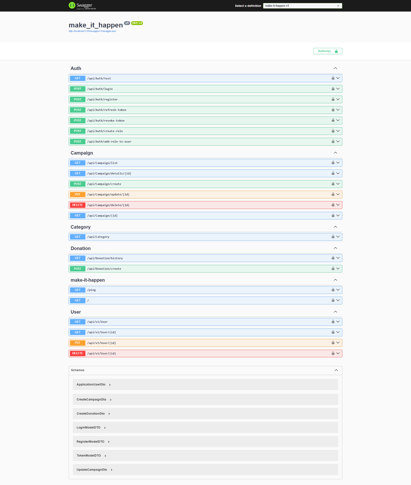

# Make It Happen API

⚠️ **IMPORTANT NOTICE** ⚠️

```diff
- This project is currently in active development.
- Features may be incomplete, unstable, or subject to change.
- Use with caution in production environments.
```
**We appreciate your interest and patience as we work to improve and stabilize the API.**


A robust backend API built with .NET 8 for managing crowdfunding campaigns and donations. This API provides comprehensive endpoints for user authentication, campaign management, and donation processing.


## 🚀 Technologies

- .NET 8
- ASP.NET Core Web API
- Entity Framework Core
- JWT Authentication
- Swagger/OpenAPI Documentation

## 📋 Features

- **Authentication**
  - User registration and login
  - JWT token management
  - Role-based authorization

- **Campaign Management**
  - Create and manage campaigns
  - Campaign categorization
  - Campaign details and status tracking

- **Donation System**
  - Process donations
  - Donation history tracking
  - Campaign funding status

- **User Management**
  - User profiles
  - Role management
  - User activity tracking



## 🛠️ Setup

1. **Prerequisites**
  ```bash
  - .NET 8 SDK
  - MySQL (or your preferred database)
  - Visual Studio or VS Code
```

  2. **Clone the repository**

  ```shellscript
  git clone git@github.com:marina-barbosa/make-it-happen-backend.git
  cd make-it-happen
  ```


3. **Update database connection** : 
Update the connection string in `appsettings.json`


```json
{
  "ConnectionStrings": {
    "DefaultConnection": "Your-Connection-String"
  }
}
```


4. **Apply migrations**

```shellscript
dotnet ef database update
```


5. **Run the application**

```shellscript
dotnet run
```


## 🔑 API Endpoints

### Auth

- `POST /api/auth/register` - Register new user
- `POST /api/auth/login` - User login
- `POST /api/auth/refresh-token` - Refresh JWT token
- `POST /api/auth/revoke-token` - Revoke token
- `POST /api/auth/create-role` - Create new role
- `POST /api/auth/add-role-to-user` - Assign role to user


### Campaign

- `GET /api/campaign/list` - Get all campaigns
- `GET /api/campaign/{id}` - Get campaign details
- `POST /api/campaign/create` - Create new campaign
- `PUT /api/campaign/update/{id}` - Update campaign
- `DELETE /api/campaign/delete/{id}` - Delete campaign


### Category

- `GET /api/category` - Get all categories


### Donation

- `GET /api/donation/history` - Get donation history
- `POST /api/donation/create` - Create new donation


### User

- `GET /api/user` - Get all users
- `GET /api/user/{id}` - Get user details
- `PUT /api/user/{id}` - Update user
- `DELETE /api/user/{id}` - Delete user


## 📚 Documentation

API documentation is available via Swagger UI at `/swagger` when running the application in development mode.

## 🔒 Authentication

The API uses JWT Bearer token authentication. To access protected endpoints:

1. Register a new user or login
2. Use the received token in the Authorization header:

```
Authorization: Bearer {your-token}
```


## 🤝 Contributing

1. Fork the repository
2. Create your feature branch (`git checkout -b feature/AmazingFeature`)
3. Commit your changes (`git commit -m 'Add some AmazingFeature'`)
4. Push to the branch (`git push origin feature/AmazingFeature`)
5. Open a Pull Request


## 📝 License

This project is licensed under the MIT License - see the [LICENSE.md](LICENSE.md) file for details.

## ✨ Acknowledgments

- [ASP.NET Core Documentation](https://docs.microsoft.com/en-us/aspnet/core)
- [Entity Framework Core](https://docs.microsoft.com/en-us/ef/core)
- [JWT Authentication](https://jwt.io)


